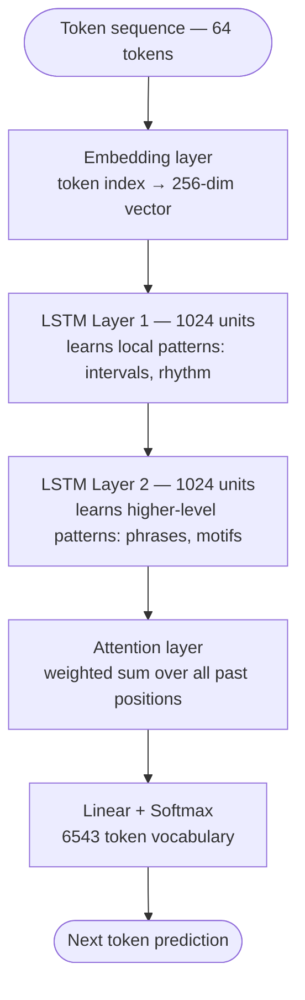
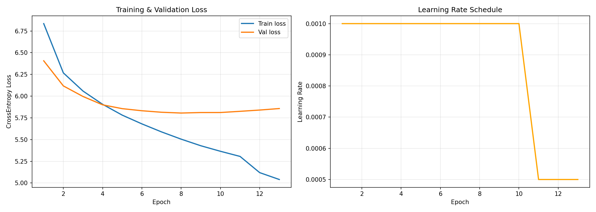

# 🎵 Music Generation with LSTM — CodeAlpha Task 3

> CodeAlpha AI Internship · Task 3  
> Symbolic piano music generation using a Stacked LSTM + Attention model trained on ~12,000 MIDI files

[](https://www.python.org/)
[](https://pytorch.org/)
[](https://huggingface.co/KalineZephyr/music-lstm-midi-codealpha)
[](https://www.kaggle.com/)

---

## Demo

> 🎧 **Sample output:** [`artifacts/generated.mid`](artifacts/generated.mid)  
> 🤗 **Model weights:** [KalineZephyr/music-lstm-midi-codealpha](https://huggingface.co/KalineZephyr/music-lstm-midi-codealpha)

---

## Overview

This project builds a **symbolic music generation system** from scratch using classical deep learning — no pre-trained LLM, no external AI API.

The model learns to predict the next musical token given a sequence of 64 past tokens, where each token encodes three musical attributes simultaneously: **pitch**, **duration**, and **velocity** (dynamics). After training on 46 million musical events extracted from ~12,000 MIDI files, it can generate new piano pieces token by token in an autoregressive fashion — the same principle used by language models to generate text.

---

## Architecture



### Why LSTM + Attention?

Standard LSTM has limited memory — it forgets context from many steps ago. The **attention layer** addresses this by computing a weighted sum over the entire LSTM output sequence, letting the model "look back" at any past token when predicting the next one. This is a lightweight alternative to a full Transformer that stays within the scope of the task while improving musical coherence.

---

## Dataset

| Dataset | Files | Events | Source |
|---|---|---|---|
| Maestro v3.0.0 | 1,276 | ~6M | Google Magenta — professional piano recordings |
| GiantMIDI-Piano v1.21 | 10,841 | ~41M | ByteDance — piano transcriptions from YouTube |
| **Total** | **12,109** | **~46M** | |

Each MIDI file is parsed with **symusic** (C++ parser, 100x faster than music21) and encoded as `(pitch, duration_bucket, velocity_bucket)` triples:
- **128** pitch values (MIDI standard)
- **10** duration buckets (thirty-second → whole note)
- **8** velocity buckets (ppp → fff, classical nuances)

Final vocabulary: **6,543 unique tokens**.

---

## Training

| Hyperparameter | Value | Rationale |
|---|---|---|
| Hidden size | 1024 | Large enough for 46M events without overfitting |
| Layers | 2 | Layer 1 = local patterns, Layer 2 = phrase-level |
| Embedding dim | 256 | Standard for vocab size ~6k |
| Batch size | 256 | Fills ~26GB of 30GB VRAM on 2×T4 |
| Dropout | 0.3 | Regularization between LSTM layers |
| Optimizer | Adam (lr=0.001) | Standard for sequence models |
| Scheduler | ReduceLROnPlateau | Halves LR if val loss stagnates for 2 epochs |
| Grad clip | 5.0 | Prevents exploding gradients in deep LSTMs |

**Training ran on Kaggle 2×T4 GPUs** with `torch.nn.DataParallel`. Early stopping triggered at epoch 13, best model saved at **epoch 8** (val_loss = 5.805).

For reference: a random baseline would score `ln(6543) ≈ 8.78`. The model reaches **5.80** — significantly better than chance.

### Training curves



The validation loss diverges from training loss around epoch 8 — classic early overfitting on a LSTM due to its limited long-range memory. The best checkpoint is used for generation.

---

## Project Structure

```
CodeAlpha_Music_Generation/
│
├── artifacts/
│   ├── vocab.json              ← token ↔ (pitch, duration, velocity) mappings
│   ├── training_curves.png     ← loss & LR schedule plots
│   └── generated_temp09.mid   ← sample generation (temperature=0.9)
│
├── notebooks/
│   ├── 01_preprocessing.ipynb  ← MIDI parsing, tokenization, .npy export
│   └── 02_training.ipynb       ← model training, generation, MIDI export
│
├── generate.py                 ← inference script (CLI)
├── requirements.txt
├── .gitignore
└── README.md
```

> **Model weights** (`best_model.pt`, 264MB) are stored on HuggingFace and downloaded automatically by `generate.py`.

---

## Quickstart

### Install

```bash
git clone https://github.com/Tahsine/CodeAlpha_Music_Generation
cd CodeAlpha_Music_Generation
python -m venv .venv && source .venv/bin/activate
pip install -r requirements.txt
```

### Generate MIDI

```bash
# Basic — downloads model automatically from HuggingFace on first run
python generate.py

# With options
python generate.py \
    --n_tokens    512 \
    --temperature 0.9 \
    --bpm         120 \
    --output      artifacts/my_music.mid
```

### Generate MIDI + WAV

```bash
# Install FluidSynth (system dependency)
sudo apt-get install fluidsynth   # Linux
brew install fluidsynth            # macOS

# Generate — soundfont downloads automatically on first run (~30MB)
python generate.py --n_tokens 512 --temperature 0.9 --audio
```

### Temperature guide

| Temperature | Effect | Best for |
|---|---|---|
| `0.7` | Conservative — coherent but repetitive | Background music |
| `0.9` | Balanced — musical and varied | General use |
| `1.1` | Creative — surprising but less coherent | Exploration |

---

## How it works

Generation is **autoregressive** — the model predicts one token at a time, appending it to the sequence and using it as context for the next prediction. This is the same mechanism used by GPT to generate text.

```
seed (64 tokens) → model → next token
append → slide window → model → next token
...repeat N times...
→ decode tokens → music21 → .mid → FluidSynth → .wav
```

Temperature controls the randomness: `logits / temperature → softmax → sample`. Lower temperature sharpens the distribution (more predictable), higher temperature flattens it (more creative) — identical to the `temperature` parameter in LLMs.

---

## Dependencies

| Package | Role |
|---|---|
| `torch` | Model training & inference |
| `symusic` | Fast MIDI parsing (C++, preprocessing only) |
| `music21` | MIDI generation from token sequences |
| `midi2audio` | WAV conversion via FluidSynth |
| `huggingface_hub` | Automatic model download |
| `numpy` | Array handling |
| `tqdm` | Progress bars |

---

## License

MIT
